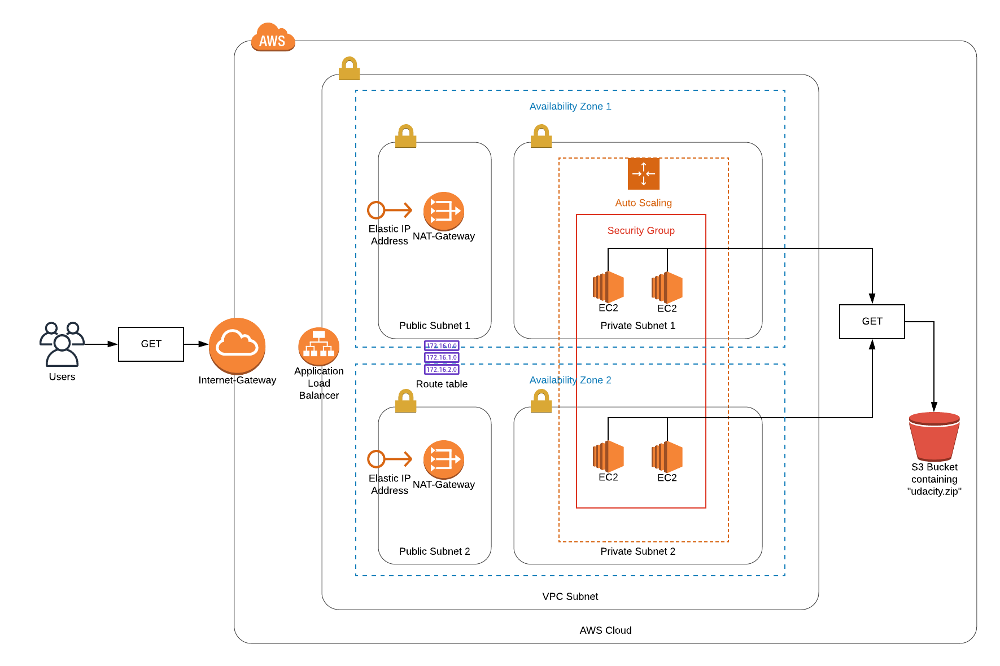

# Udacity Nanodegree: Cloud DevOps Engineer (nd9991)

## Project 2
This is a project submission for the Nanodegree "Cloud DevOps Engineer" by [Udacity](https://www.udacity.com/course/cloud-dev-ops-nanodegree--nd9991).

### URL to running project
[Project 2 "Udagram"](http://udaci-webap-wdg2033pukkv-1941474520.us-west-2.elb.amazonaws.com/) (will be disabled when project is rated)

### Setup
* Network: `./create.sh udacity-p2-network p2_network.yml p2_network_params.json`
* Servers: `./create.sh udacity-p2-servers p2_network.yml p2_servers_params.json`

### Overview Diagram
Created with [Lucidchart](https://www.lucidchart.com/).
